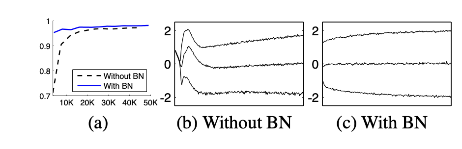
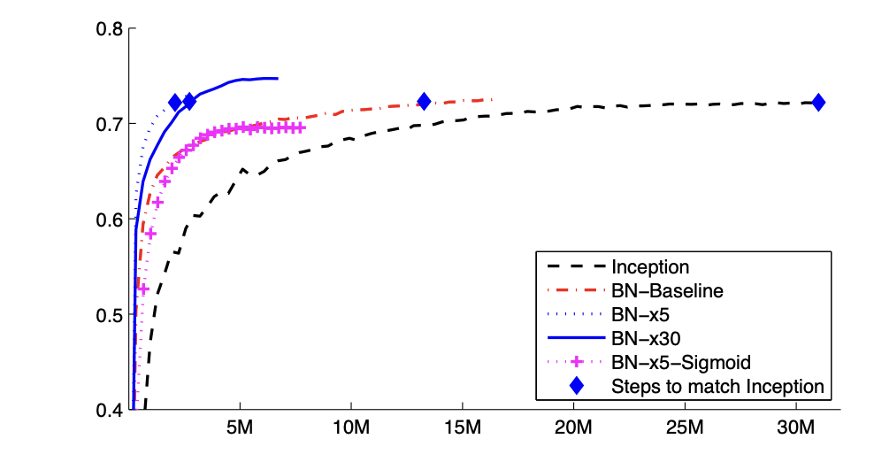
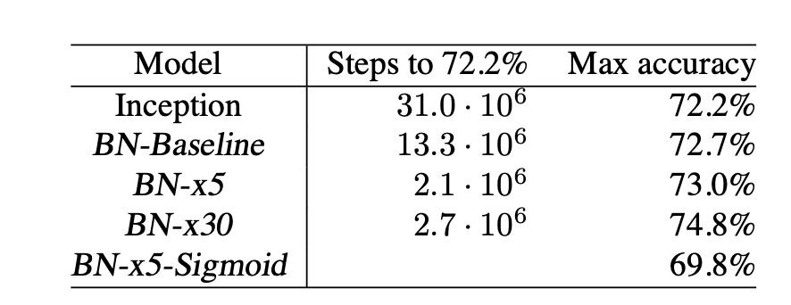
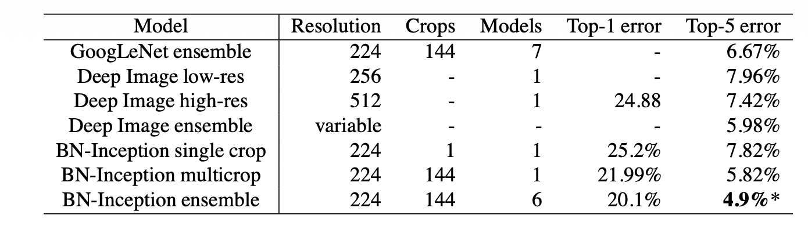

# Бикмухаметов Тагир Ильшатович
 
## AS IS
```
Давайте вернемся в 2015 год. Доллар по шисят рублей, в России можно смотреть ютуб, все хорошо, но вот только одна проблема. Нет никакого батч норма. Почему это проблема?
```

Главная беда заключается в *Internal Covariate Shift* - ситуации, когда, казалось бы, слой $n$ как-то обучился на текущем шаге $i$, кроме него свои веса поменяли и другие слои, в том числе, слои до него. Теперь эти слои, которые были до слоя $n$, с измененными весами, дают на вход слою $n$ совершенно другие числа, которым с большой вероятностью могут не подойти текущие веса. В статье описано, как проблему решают сейчас. Для этого выделим более строго, что значит "числа не подходят слою $n$":

* Чиселки вытолкнули слой в точку насыщения функции ошибки, когда градиенты настолько малы, что веса уже почти не меняются. Причем проблема усугубляется с ростом глубины сети. (Так как Backpropagation предполагает домножение ошибки на градиенты слоев при движении вглубь, а градиенты, как описано выше, могут стать малыми. Много маленьких градентов вместе дадут оооочень маленькое изменение весов)
* Как следствие, модель становится более капризной по отношению к инициализизации весов. Потому что при плохой инициализации мы со старта будем медленно обучаться.

Собственно, на момент 2015 года эту беду решают так:
1. Добавляют слои активации с ReLu ($max(x, 0)$), у которой градиент будет иметь здравое значение в силу линейности функции на положительной части. 
2. Аккуратно инициализируют веса.
3. Ставят маленькие LR, чтобы случайно не вылететь в такую точку насыщения. 

```
Очевидно, это невероятно замедляет обучение (пункт 3) + вызывает трудности, так как надо сильно запариться по поводу инициализации весов (пункт 2).
```

## Идея

Еще для линрега все давно поняли, что нормализовать данные важно и полезно. Собсвтенно, почему бы не попробовать применить это к нейронным сетям? 

## Первые шаги и проблемы
В статье описываются различные проблемы, с которыми столкнулись авторы в процессе работы. 

* Если добавлять слой, который будет нормализовывать данные, принимая на вход вектор $u$, потом добавляя туда обучаемые биас $b$ и вычитая из всего этого матожидание $E[x],$ где $x = u + b$, то окажется, что при изменении b выход никак не изменится, так как вместе с b изменится и $E[x]$ в ту же сторону. При вычитании $$u + (b + \Delta b)−E[u + (b + \Delta  b)] = u + b−  E[u + b].$$ Вроде добавили параметр, а при его изменении ошибка никак не изменилась. Причем, как описано в статье, проблема ухудшается, если добавить второй параметр, который растягивает выход (не только центрирует). Эту проблему авторы зафиксировали эмпирически.
* Такая проблема возникает, потому что b обучается сам по себе. Поэтому можно было предположить, что мы делаем нормализацию, которая является функцией не только от входных данных, но и кумулятивно копит в себе информацию о предыдущих входах. Получится $$\hat{x} = Norm(x, X).$$ Возникает другае проблема: после каждого обновления параметров нужно проводить анализ всего обучающего набора для обновления весов. Слишком дорогая операция.

## Итоговое решение
Ясно, что нужно придумать что-то посередине между описанными выше методами. По итогу было принято два допущения.
1. Считать, что величины, которые мы нормализуем, некоррелированы (хотя ясно, что это не так). Поэтому для слоя с входом. $$x = (x^{(1)} . . . x^{(d)}).$$ Будет нормироваться каждое измерение по отдельности. $$\hat{x}^{(k)} = \frac{x^{(k)} - E[x^{(k)}]}{\sqrt{Var[x^{(k)}]}}$$ И после этого полученное значение так же чуть растянется и сдвинется $$y^{(k)} = \gamma^{(k)}\hat{x}^{(k)} + \beta^{(k)}$$. Где $\gamma^{(k)}$ и $\beta^{(k)}$ - обучаемые параметры. Это нужно, так как иначе мы ограничим модель. Если выдавать в среднем ноль при такой нормализации, то, например, сигмоида будет находиться в своей линейной части. Тогда слой активации мы превратим в, по сути, линейный слой, что убивает смысл активации.
2. Будем считать все статистики внутри мини-батчей, а не по всей выборке. Иначе нам бы пришлось прогонять через нейросеть весь набор данных, чтобы дойти до слоя, который мы нормализуем. Убивает всю суть стохастической оптимизации.

Алгоритм выглядит так:

1. $$\mu_{\mathcal{B}} \leftarrow \frac{1}{m} \sum_{i=1}^m x_i$$
2. $$\sigma_{\mathcal{B}}^2 \leftarrow \frac{1}{m} \sum_{i=1}^m\left(x_i-\mu_{\mathcal{B}}\right)^2$$
3. $$\widehat{x}_i \leftarrow \frac{x_i-\mu_{\mathcal{B}}}{\sqrt{\sigma_{\mathcal{B}}^2+\epsilon}}$$
4. $$y_i \leftarrow \gamma \widehat{x}_i+\beta \equiv \operatorname{BN}_{\gamma, \beta}\left(x_i\right)$$

На вход он получает мини-батч из $m$ объектов $\{x_{1\ldots m} \}$, а на выходе нормализованные объектики $\{y_{1\ldots m} \}$. Обучаемыми параметрами являются $\gamma$ и $\beta$. 
Осталось понять, как посчитать градиенты для backpropagation. По сути, батчнорм является линейным слоем, которому на вход подают уже отнормированные объекты ($\hat{x}$), поэтому backpropagation здесь довольно прост. Немного формул, чтобы получить строгий вывод
$$
\begin{align*}
\frac{\partial \ell}{\partial \widehat{x}_i} &= \frac{\partial \ell}{\partial y_i} \cdot \gamma \\
\frac{\partial \ell}{\partial \sigma_{\mathcal{B}}^2} &= \sum_{i=1}^m \frac{\partial \ell}{\partial \widehat{x}_i} \cdot (x_i - \mu_{\mathcal{B}}) \cdot \left(-\frac{1}{2}\right)(\sigma_{\mathcal{B}}^2 + \epsilon)^{-3/2} \\
\frac{\partial \ell}{\partial \mu_{\mathcal{B}}} &= \left( \sum_{i=1}^m \frac{\partial \ell}{\partial \widehat{x}_i} \cdot \frac{-1}{\sqrt{\sigma_{\mathcal{B}}^2 + \epsilon}} \right) + \frac{\partial \ell}{\partial \sigma_{\mathcal{B}}^2} \cdot \frac{\sum_{i=1}^m -2(x_i - \mu_{\mathcal{B}})}{m} \\
\frac{\partial \ell}{\partial x_i} &= \frac{\partial \ell}{\partial \widehat{x}_i} \cdot \frac{1}{\sqrt{\sigma_{\mathcal{B}}^2 + \epsilon}} + \frac{\partial \ell}{\partial \sigma_{\mathcal{B}}^2} \cdot \frac{2(x_i - \mu_{\mathcal{B}})}{m} + \frac{\partial \ell}{\partial \mu_{\mathcal{B}}} \cdot \frac{1}{m} \\
\frac{\partial \ell}{\partial \gamma} &= \sum_{i=1}^m \frac{\partial \ell}{\partial y_i} \cdot \widehat{x}_i \\
\frac{\partial \ell}{\partial \beta} &= \sum_{i=1}^m \frac{\partial \ell}{\partial y_i}
\end{align*}
$$

## Когда сеть обучилась

Для предикта уже фиксируются значения дисперсии и среднего. Они считаются кумулятивно при помощи скользящих средних. Фиксируются
$$E[x] \leftarrow E_\mathcal{B}[\mu_{\mathcal{B}}]$$
$$Var[x] \leftarrow \frac{m}{m - 1}E_\mathcal{B}[\sigma_{\mathcal{B}}^2].$$ 

Здесь можно заметить, что авторами предлагается несмещенная оценка дисперсии (логично). Буквой $m$ обозначается размер батча (все батчи считаются одинаковыми по размеру в предложенном алгоритме).
По итогу алгоритм такой:
1. Обучаем наши параметры $\gamma$ и $\beta$ на добавленных слоях батчнорма.
2. Фиксируем общие среднее и дисперсию.
3. При предикте нормализуем данные с учетом зафиксированных среднего и дисперсии.

## Где использовать

Авторы рекомендуют добавлять батчнорм перед активациями (в статье рассматриваются ReLu и сигмоида) и после линейности. Можно пробовать нормализовать и данные до линейности, но, поскольку, они являются результатом нелинейности, то их распределение, скорее всего, менее "нормальное", отчего батчнорм может чуть больше исказить картинку.

## Для сверточных сетей

В сверточных сетях есть важное правило - некоторый признак в одной части картинки должен распознаваться так же и в другой части картинки. Обыкновенный батч норм этому свойству не удовлетворяет, так как будет считать среднее и дисперсию в рамках одного пикселя картинки (обычно мы там используем свертки. Но, строго говоря, одного индекса в матрице), и тогда перенос в другую часть картинки поменяет дисперсию и среднее. Поэтому тут нужно чуть подкорректировать алгоритм. Если карта признаков имеет размер $p \times q$, ты мы говорим, что работаем не с батчом из $m$ признаков, а как бы с батчом из $m \times p \times q$ признаков, считая статистики по всей карте признаков.

## Решенные проблемы

* Теперь можно использовать более высокие значения LR, так как батчнорм развязал ML-щикам руки в этом плане. 

* Также можно иногда отказываться от дропаута, так как батчнорм так же перенимает на себя некоторые его функции (спасая от оверфиттинга).

* Уменьшать вес регуляризации. Опять же, за счет того, что батчнорм спасает от оверфиттинга.

* В целом можно отказываться от некоторых гиперпараметров. Как в статье было принято решение отказаться от LRN на ImageNet, поскольку оказалось, что это не нужно (так как великий батч норм и сам отлично справляется с "сглаживанием картины", что ранее делалось при помощи LRN). 

## На практике

* На MNIST получилось добиться следующих результатов:


(а) Accuracy на тесте с и без батчнорма. 

(b, c) Эволюция распределений входных данных для типичной сигмоиды в процессе обучения, представленная в виде 15-й, 50-й и 85-й процентилей.

Видим на картинке а, что нейросеть с BN достигла за первые 10к итераций результатов, до которых ранее нужно было идти 30к шагов. На картинках (b, c), видим, как BN стабилизирует распределение входных параметров для нелинейного слоя (сигмоиды в данном случае).

* На ImageNet картинка следующая




x5 и x30 означают, во сколько раз был увеличен стартовый LR.
Sigmoid - это модель, где вместо ReLu использовали сигмоиду.

И сразу видим, что даже без использования преимущества, связанного с возможностью увеличения LR, модель с обычным добавлением BN обучилась за 13кк шагов вместо 30кк до уровня в 72.2% accuracy. А при увеличении стартового LR в 5 раз получилось довести модель до таких значений за 2.1кк шагов. В 15 раз быстрее оригинала.

Сделав ансамбль моделей, авторы статьи подвинули предыдущий SOTA на ImageNet
