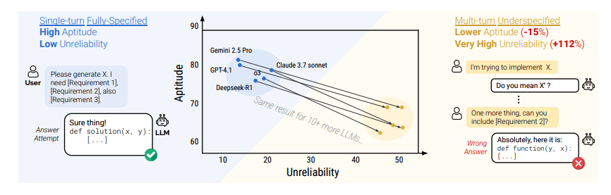
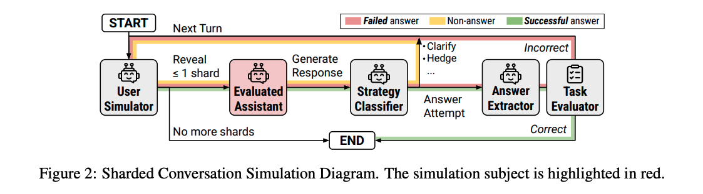
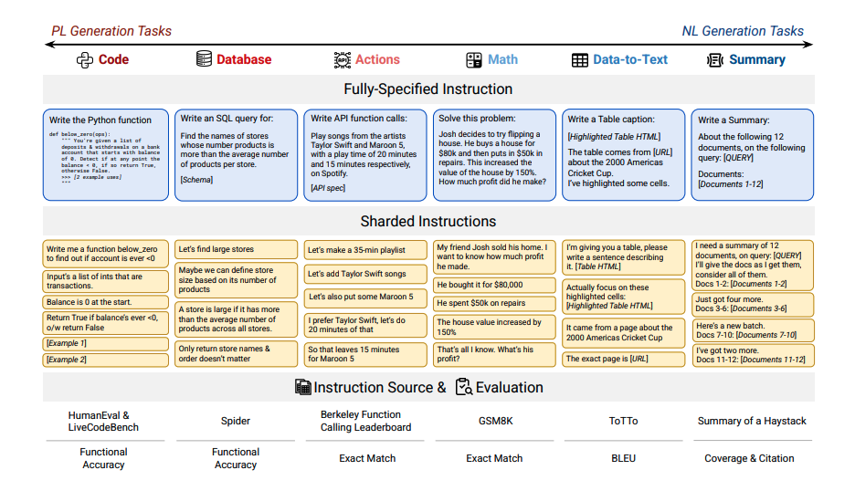
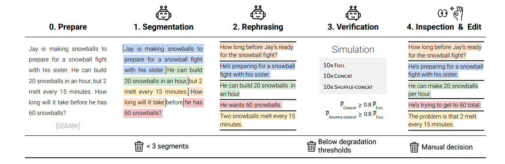
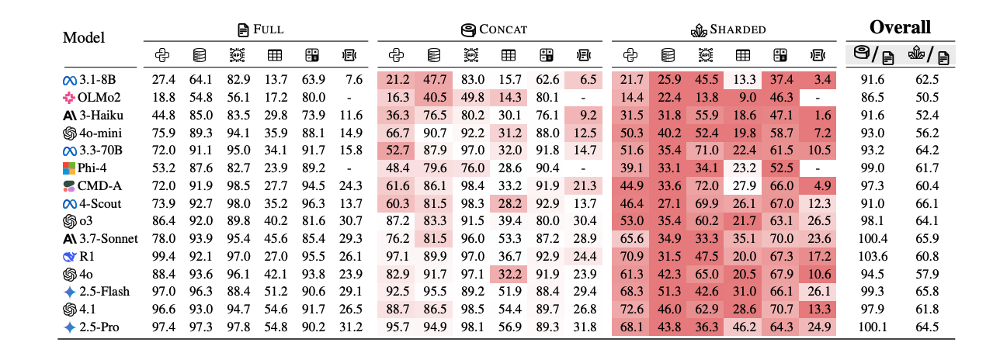
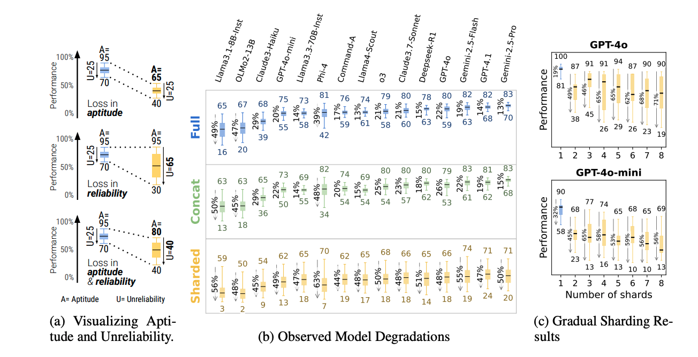

# Бикмухаметов Тагир Ильшатович
*Разбор статьи "LLMs Get Lost In Multi-Turn Conversation"*

## Проблематика

Промт-инжиниринг, оказывается, действительно важен. Если говорить про то, как сильно качество запроса влияет на результат ответа модели, то лучше всего это покажет такая картинка:

По-русски говоря, если модели дать один промт с четкими требованиями, то она проявит высокую компетентность (Aptitude) и низкую ненадеждность (Unreliability). Плохой промт и растятнутый диалог для представленных на картинке моделей понижает компетентность на 15% и повышает ненадежность на 112%. 

Вроде логично. Пользователь сам виноват, что плохо задает вопросы. Можно было бы и четче писать.

Но на самом деле нормально, что пользователь может не понимать изначально того, что он хочет. В процессе спрашивать у LLM совет, что-то дорабатывать. 

И в статье есть логичная претензия к бенчмаркам (и к методам обучения моделей). Сейчас все это зачастую делается для одного промта. Модель справилась с таким промтом -- круто, ответила неверно -- некруто. При этом модели довольно редко проверяют на способность нормально работать с поступающей последовательно информацией. Авторы подсвечивают эту проблему.

## Что предлагают авторы?

Авторы статьи придумали новый метод оценивания качества LLM, делая это при помощи шардирования информации. 

* Берется вопрос из бенчмарка
* Информация из вопроса разбивается на несколько кусков, которые вместе несут такой же объем информации
* Эти кусочки (шарды) подаются в модель в рамках диалога, а не одного промта
* Происходит оценка выходного результата.

**Почему это правильнее?** – в целом, выше уже вкратце описано. Так делать лучше, поскольку люди руководствуются принципом наименьших усилий: проще ответить на уточняющие вопросы LLM, чем заранее продумать все корнеркейсы, дать четкое ТЗ. 

**Как это устроено внутри?** – авторы буквально имитируют человека. Если разбить процесс оценки по шагам, то мы получим следующее:
* Симулятор пользователя раскрывает не более 1 шарда информации модели
* Модель отвечает на вопрос
* Классификатор определяет: вопрос уточняющий или это попытка сгенерировать итоговый результат
* Далее результат оценивается. Если он правльный, процесс оценки завершается. Если он неправильный и при этом у "пользователя" еще есть шарды информации, то мы возвращаемся к первому шагу. Иначе процесс заканчивается.

На картинке процесс выглядит следующим образом:

## Внутри каждого шага

Глобально есть две задачи:
1. Нормально разбить запрос на шарды
2. Реализовать корректную подачу шардов

### Процесс шардирования

Для начала нужно определить понятие "хорошего" шардирования. 

1. Сохранение информации: все шарды вместе дают ту же информацию, что изначальный запрос. Не скрывают ничего и не добавляют.
2. Ясность намерений: с первого шарда должно быть понятно, чего хочет пользователь
3. Отсутствие чувствительности к порядку: порядок выдачи шардов не должен сильно влиять на требуемый результат (что поддерживать довольно трудно, но такая компонента в требовании довольно логична.)

**Как это реализовали авторы**

Шардирование разбили на несколько этапов:

1. Сегментация запроса на части
2. Перефразирование (чтобы запросы выглядели более естественно)
3. Верификация (шарды склеиваются, подаются в тестируемую модель одним промтом. Ее результат не должен сильно ухудшиться, иначе получится противоречие с требованием к сохранению информативности.)
4. Ручная проверка

Примеры разбиения на шарды запросов по разным областям
:

Более глубокая постановка задачи такая:
У нас есть некоторый запрос q. Предполагается, что он состоит из набора атомов $I(q)$: первичного намерения $\mathcal{I}$ и набора уточнений $(c_1, \dots, c_m)$.
А нам нужно получить $q' = [s_1, \dots, s_k]$, чтобы их совокупный смысл совпадал с изначальным: $I(q) = I(q')$.

Список требований к $q'$ выглядит следующим образом:

(Тут нейрослоп, потому что ну просто перевести 5 пунктов на другой язык)
* P1: Сохранение информации (Information Preservation): Ни одна деталь, необходимая для решения задачи, не должна быть потеряна.
* P2: Ясное начальное намерение (Clear Initial Intent): Первый «осколок» ($s_1$) должен четко задавать общую цель диалога (например, «напиши функцию»).
* P3: Независимость от порядка (Order Insensitive): За исключением первого осколка, остальные могут поступать в любом порядке, не меняя сути задачи.
* P4: Максимальное разбиение (Maximal Sharding): Процесс должен стремиться к максимальному количеству осколков, где каждый вводит только один конкретный элемент информации.
* P5: Минимальная трансформация (Minimal Transformation): Нужно максимально сохранить оригинальный язык и стиль инструкции, избегая интерпретаций или упрощений.

Иллюстративно описанные шаги выглядят так:

На картинке важно отметить трешхолды для отказа от дальнейшей работы с запросом:
1. Если не получилось его разбить на 3 или более шардов
2. На моменте верификации эффективность модели для объединенных и для объединенных в случайном порядке запросов должна упасть не более, чем на 20%
3. Ручная проверка. Тут фулл объективность, авторы попадают в топ 10 тыщ по адекватности

### Процесс подачи шардов и оценки

Ясно, что подавать шарды подряд, заранее их перемешав, некорректно, так как LLM может задавать уточняющие вопросы, требующие конкретного шарда. Поэтому на роль симулятора пользователя была выбрана GPT-4o-mini. Сама модель изначально видела весь список шардов.

На роль модели, вытаскивающей ответ из сгенерированного результата и на роль классификатора ответов была также использована GPT-4o-mini. 
 
Такую систему приняли надежной, так как ошибки в ней случались примерно в 5% кейсов. И в 2% кейсов случилось занижение балла из-за этой ошибки. Сам балл выставлялся как максимум из всех заработанных за все ответы баллов (ответов, ясное дело, не одна штука, так как модель может с появлением новой информации принимать новые попытки для выдачи ответа).

## Способ оценки
### Типы симуляций и зачем они нужны

1. Полная – сразу с полной инструкцей. "Идеальный" запрос для модели
2. Шардированная – как описано выше. Каждый раз юзер добавляет новую информацию. Проверяет главную проблему современных моделей: ухудшение качества работы при последовательно поступающей информации.
3. Конкатенация – шарды склеиваются и направляются модели вместе. В идеальном мире ответ не должен концептуально отличаться от ответа при полной симуляции. Если ответ модели сильно ухудшился тут, то это сигнал того, что шардирование было сделано плохо
4. Рекап: проводится шардированная симуляция + в конце дается сконкатенированный результат (комбинация 2 и 3 типов). Проверяет, может ли модель исправиться, когда ей заново дадут уже полную информацию.
5. Снежный ком -- каждый новый запрос добавляет к старому запросу приписывает новый шард, получая в самом конце сконкатенированный запрос. Проверяет, насколько перегружается память модели при длинныйх диалогах

### Какие типы задач оценивались?

Авторы выделили 6 видов задач из известных бенчмарков:
(нейрослоп)

*Code (Код): Ассистент создает функцию Python согласно инструкциям из HumanEval и LiveCodeBench. Качество результата оценивается с помощью метрики функциональной точности.

* Database (Базы данных): Ассистент формирует SQL-запросы на основе естественного языка и схемы базы данных, используя набор данных Spider. Оценка производится по функциональной точности.

* Actions (Действия): Ассистент генерирует вызовы API, опираясь на заданные схемы, используя данные из Berkeley Function Calling Leaderboard (BFCL). Результат оценивается через точное совпадение (Exact Match).

* Math (Математика): Ассистент решает математические задачи из набора данных GSM8K. Оценка также проводится по критерию точного совпадения.

* Data-to-text (Данные в текст): Ассистент пишет описание таблицы и связанных метаданных на основе набора данных ToTTo. Качество определяется метрикой BLEU.

* Summary (Саммари/Реферирование): Ассистент создает резюме с цитатами, используя данные из проекта Summary of a Haystack. Для этой задачи применяется пользовательская метрика "Joint Score".

Для каждого типа было подготовлено 90-120 инструкций, итоговые метрики отнормированы до диапазона 0 (отвратительный результат) – 100 (все сделал четко) для упрощения агрегации.

### На какие метрики смотрели

Выше были упомянуты метрики "компетентность" (Aptitude) и "ненадеждность" (Unreliability).

Определим их.

* Средний перформанс – $\bar{P}$ – среднее арифметическое оценок $S_i$, полученных в результате $N$ независимых симуляций для конкретной инструкции. Формула: $\bar{P} = \sum_{i=1}^{N} S_i / N$

* Компетентность – $A^{90} = percentile_{90}(S)$. Какой перформанс выдают лучшие симуляции.

* Ненадежность – $U^{90} = percentile_{90}(S) - percentile_{10}(S)$. Показывает разрыв между худшими и лучшими ответами (если разрыв большой, то модель, даже если может дать хороший ответ, сделает это менее вероятно).

### Циферки
По итогу, если сравнивать с полной симуляцией (то получим такую картинку):

То есть в целом модели нормально справляются исправить свой ответ, если в конце им дать склеенный промт. При этом их средний перформанс ухудшается на 35-50% при шардировании в сравнении с изначально полным запросом.

Декомпозируя на указанные метрики, получим следующую картину:

*Картинка (а) показывает потери модель в указанных метриках и в их комбинации. Картинка (б) показывает деградацию моделей (метрику U) в зависимости от типов симуляций. Картинка (с) показыает перформансы GPT-4o и GPT-4o-mini по мере роста количества шардов*

Каринка с довольно интересная. Видно, что существенная разница наблюдается по сути только при увеличении количества шардов до числа большего 1, а далее перформанс не сильно падает (применимо только GPT-4o и GPT-4o-mini. Но хочется сказать, что этот результат можно спокойно экстраполировать на остальные современные модели).

## Что имеем?

### Общая картина

* Крутые модели не защищены от деградации. Видим, что даже крутые модели получали при шардированные такую же относительную просадку (в сравнении с Full-симуляцией), как и более компактные и слабые модели.

* Крутые модели лучше исправляются. На конкатенации сильные модели почти не просаживались, слабые же показывали средний перформанс на 8-14% хуже, чем на полном запросе.

* Из наблюдений выше можно понять, что, так как современные сильные модели перформят на конкатенации так же хорошо, как и для полного запроса, можно сделать вывод, что ухудшение перформанса на шардированной симуляции не вызвано потерей информацией при перефразировании (так как при конкатенации результат почти не ухудшается). 

* Дополнительные токены на размышление не помогают моделям улучшить перформанс. Потенциальная причина заключается в том, что такие модели выдают ответ в среднем на 33% длиннее не размышляющих моделей, где они выставляют ложные гипотезы и предположения, путая себя.

### Анализ зависимости ненадежности и компетентности

* Сильные модели на фулл-симуляции показывают показатели ненадежности и компетентности лучше, чем слабые. Можно делать вывод о том, что между этими метриками есть связь. 

* При шардировании у всех моделей ненадежность взлетала очень сильно: в среднем 112%. Лучшие и худшие ответы для каждой модели могут отличаться более чем на 50%. То есть ухудшение среднего перформанса при применении шард-симуляции связано больше как раз с ростом ненадежности, чем с падением некомпетентности
### Причины

Авторы выделяют 4 причины

1. Модели рано предпринимают первые попытки ответить, основываясь на ложных предположениях, отчего начинают путаться

2. Модели начинают полагаться на свои предыдущие ответы, которые являются ошибочными по причинам, описанным в (1)

3. Потеря средней части диалога. Модели сильно полагаются на первый запрос и последний, часто забывая про оставшуюся часть диалога (из середины).

4. Модели генерируют слишком длинные ответы, в которые попадают ложные предположения, что тоже вызывает рост ошибки.

